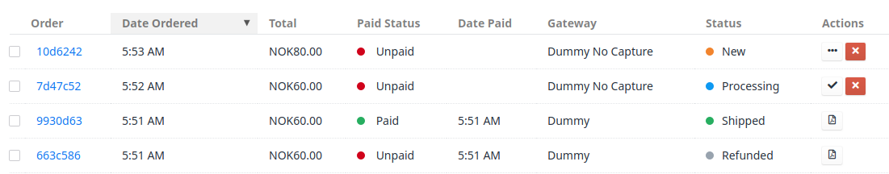
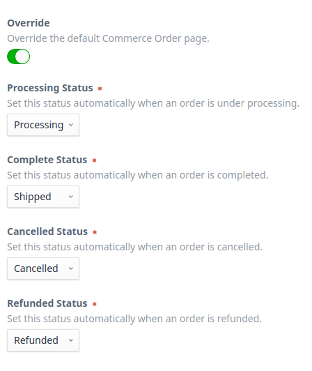
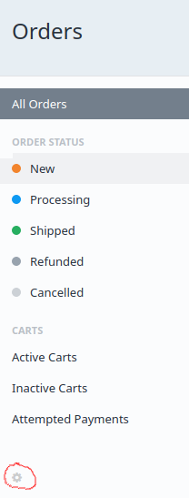
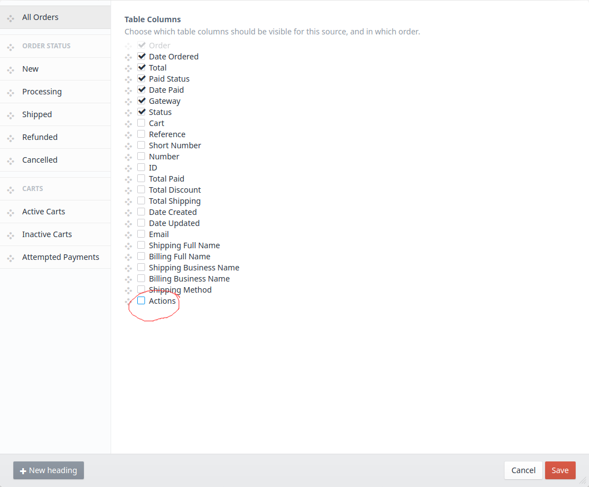

# Quick Order Actions for Craft Commerce

This plugin provide easy-to-access buttons in the order list.

## Requirements

This plugin requires Craft Commerce 2.0.0 or later.

## Installation

You can install this plugin from the Plugin Store.

#### From the Plugin Store

Go to the Plugin Store in your project’s Control Panel and search for “Quick Order Actions”. Then click on the “Install” button in it's modal window.

## Setup

#### Order Status Mapping
The plugin renders buttons based on the Status and Paid Status of the order. You should have a minimum of five different statuses set up in your shop, and then open the settings page for this plugin and map statuses to buttons.
Unless all order statuses have their value set, the plugin will not take effect.

## Usage
Open the Order List settings by pressing the cog in the sub menu

When the plugin is installed properly, you'll see the ability to add an "Actions" column to the order list

When the actions column is active, you'll get quick-action buttons based on the current status of the orders status and paid status.